# Production PostgreSQL Schema

## Design Principles

TailTown should use PostgreSQL as the transactional source of truth for users, pets, vets, bookings, commerce, health records, subscriptions, referrals, notifications, and chat.

Production schema rules:

- Primary keys use UUID.
- Timestamps are stored as `timestamptz` in UTC.
- Monetary values use `numeric(12,2)`.
- Status values should be represented as PostgreSQL enums or constrained text.
- All user-owned data must be scoped by `user_id`.
- All major mutable tables include optimistic locking with `version bigint not null default 0`.
- All business tables include audit columns.
- Soft deletion uses `deleted_at timestamptz null` and `deleted_by uuid null`.
- Unique constraints that must ignore deleted rows should be implemented as partial unique indexes.
- All schema changes must be managed through Flyway migrations.
- Hibernate production mode should be `validate`, not `update`.

## Shared Audit Columns

Every table below should include:

- `created_at timestamptz not null default now()`
- `updated_at timestamptz not null default now()`
- `created_by uuid null`
- `updated_by uuid null`
- `deleted_at timestamptz null`
- `deleted_by uuid null`
- `version bigint not null default 0`

Soft delete strategy:

- User-visible deletes set `deleted_at` and `deleted_by`.
- Hard deletes are reserved for retention-policy purge jobs.
- Queries in the application must filter `deleted_at is null` by default.
- For unique user-facing fields, use partial unique indexes with `where deleted_at is null`.

Optimistic locking:

- All update operations include `where id = :id and version = :expectedVersion`.
- Successful updates increment `version`.
- Version conflicts return HTTP `409 Conflict`.

## Tables

## Users

Stores customer accounts.

Columns:

- `id uuid not null`
- `email citext not null`
- `phone varchar(32) null`
- `password_hash text null`
- `name varchar(160) not null`
- `avatar_url text null`
- `status varchar(32) not null default 'ACTIVE'`
- `email_verified_at timestamptz null`
- `phone_verified_at timestamptz null`
- `last_login_at timestamptz null`
- `marketing_consent boolean not null default false`
- `terms_version varchar(32) null`
- `privacy_version varchar(32) null`
- shared audit columns

Primary key:

- `pk_users`: `id`

Foreign keys:

- `created_by`, `updated_by`, `deleted_by` references `users(id)` when present.

Unique constraints:

- `ux_users_email_active`: unique `email` where `deleted_at is null`
- `ux_users_phone_active`: unique `phone` where `phone is not null and deleted_at is null`

Indexes:

- `idx_users_status`: `status`
- `idx_users_created_at`: `created_at`
- `idx_users_last_login_at`: `last_login_at`

Soft delete:

- Set `status = 'DELETED'`, `deleted_at`, and `deleted_by`.
- Retain transactional records for legal and audit reasons.

Optimistic locking:

- `version` controls profile, status, consent, and verification updates.

## Pets

Stores pet profiles owned by users.

Columns:

- `id uuid not null`
- `user_id uuid not null`
- `name varchar(120) not null`
- `species varchar(40) not null`
- `breed varchar(120) null`
- `gender varchar(24) null`
- `date_of_birth date null`
- `weight_kg numeric(6,2) null`
- `avatar_url text null`
- `microchip_id varchar(80) null`
- `neutered boolean null`
- `allergies text null`
- `medical_notes text null`
- shared audit columns

Primary key:

- `pk_pets`: `id`

Foreign keys:

- `fk_pets_user`: `user_id` references `users(id)`

Unique constraints:

- `ux_pets_microchip_active`: unique `microchip_id` where `microchip_id is not null and deleted_at is null`

Indexes:

- `idx_pets_user_active`: `user_id` where `deleted_at is null`
- `idx_pets_species`: `species`
- `idx_pets_created_at`: `created_at`

Soft delete:

- Set `deleted_at` and keep health records unless account deletion retention rules require purge/anonymization.

Optimistic locking:

- `version` controls profile edits and medical metadata updates.

## Vets

Stores veterinarians or care providers discoverable by customers.

Columns:

- `id uuid not null`
- `display_name varchar(160) not null`
- `specialty varchar(120) null`
- `bio text null`
- `phone varchar(32) null`
- `email citext null`
- `avatar_url text null`
- `license_number varchar(120) null`
- `license_verified_at timestamptz null`
- `status varchar(32) not null default 'PENDING_VERIFICATION'`
- `rating numeric(3,2) not null default 0`
- `review_count integer not null default 0`
- `years_experience integer not null default 0`
- `home_visit_available boolean not null default false`
- `clinic_name varchar(160) null`
- `address_line1 text null`
- `city varchar(100) null`
- `state varchar(100) null`
- `pincode varchar(20) null`
- `latitude numeric(9,6) null`
- `longitude numeric(9,6) null`
- shared audit columns

Primary key:

- `pk_vets`: `id`

Foreign keys:

- `created_by`, `updated_by`, `deleted_by` references `users(id)` when present.

Unique constraints:

- `ux_vets_license_active`: unique `license_number` where `license_number is not null and deleted_at is null`
- `ux_vets_email_active`: unique `email` where `email is not null and deleted_at is null`

Indexes:

- `idx_vets_status`: `status`
- `idx_vets_specialty`: `specialty`
- `idx_vets_city`: `city`
- `idx_vets_rating`: `rating desc, review_count desc`
- `idx_vets_location`: `latitude, longitude`

Soft delete:

- Set `status = 'DEACTIVATED'` and `deleted_at`.
- Historical bookings continue referencing the vet.

Optimistic locking:

- `version` controls admin edits, verification state, rating aggregates, and availability flags.

## BookingSlots

Stores concrete appointment inventory for vets.

Columns:

- `id uuid not null`
- `vet_id uuid not null`
- `service_type varchar(40) not null`
- `starts_at timestamptz not null`
- `ends_at timestamptz not null`
- `status varchar(32) not null default 'AVAILABLE'`
- `price numeric(12,2) not null default 0`
- `hold_expires_at timestamptz null`
- `held_by_user_id uuid null`
- shared audit columns

Primary key:

- `pk_booking_slots`: `id`

Foreign keys:

- `fk_booking_slots_vet`: `vet_id` references `vets(id)`
- `fk_booking_slots_held_by`: `held_by_user_id` references `users(id)`

Unique constraints:

- `ux_booking_slots_vet_time_active`: unique `vet_id, starts_at, ends_at` where `deleted_at is null`

Indexes:

- `idx_booking_slots_vet_time`: `vet_id, starts_at`
- `idx_booking_slots_status_time`: `status, starts_at`
- `idx_booking_slots_hold_expiry`: `hold_expires_at` where `hold_expires_at is not null`

Soft delete:

- Slots can be soft deleted only before booking.
- Booked slots should be cancelled through booking workflows, not deleted.

Optimistic locking:

- `version` prevents double hold and double booking.

## Bookings

Stores customer appointments.

Columns:

- `id uuid not null`
- `user_id uuid not null`
- `pet_id uuid not null`
- `vet_id uuid not null`
- `slot_id uuid not null`
- `service_type varchar(40) not null`
- `visit_type varchar(32) not null default 'CLINIC'`
- `scheduled_start timestamptz not null`
- `scheduled_end timestamptz not null`
- `status varchar(40) not null default 'CONFIRMED'`
- `address_id uuid null`
- `address_snapshot text null`
- `notes text null`
- `cancelled_at timestamptz null`
- `cancelled_by uuid null`
- `cancellation_reason text null`
- shared audit columns

Primary key:

- `pk_bookings`: `id`

Foreign keys:

- `fk_bookings_user`: `user_id` references `users(id)`
- `fk_bookings_pet`: `pet_id` references `pets(id)`
- `fk_bookings_vet`: `vet_id` references `vets(id)`
- `fk_bookings_slot`: `slot_id` references `booking_slots(id)`
- `fk_bookings_address`: `address_id` references `addresses(id)`
- `fk_bookings_cancelled_by`: `cancelled_by` references `users(id)`

Unique constraints:

- `ux_bookings_slot_active`: unique `slot_id` where `deleted_at is null and status in ('PENDING_PAYMENT','CONFIRMED','COMPLETED')`

Indexes:

- `idx_bookings_user_time`: `user_id, scheduled_start desc`
- `idx_bookings_pet_time`: `pet_id, scheduled_start desc`
- `idx_bookings_vet_time`: `vet_id, scheduled_start desc`
- `idx_bookings_status_time`: `status, scheduled_start`

Soft delete:

- Customer cancellation changes `status`; bookings should rarely be soft deleted.
- Soft delete is for administrative removal from normal views after retention review.

Optimistic locking:

- `version` controls status transitions, reschedules, and cancellation.

## Categories

Stores product category hierarchy.

Columns:

- `id uuid not null`
- `parent_id uuid null`
- `name varchar(120) not null`
- `slug varchar(140) not null`
- `description text null`
- `sort_order integer not null default 0`
- `is_active boolean not null default true`
- shared audit columns

Primary key:

- `pk_categories`: `id`

Foreign keys:

- `fk_categories_parent`: `parent_id` references `categories(id)`

Unique constraints:

- `ux_categories_slug_active`: unique `slug` where `deleted_at is null`
- `ux_categories_parent_name_active`: unique `parent_id, name` where `deleted_at is null`

Indexes:

- `idx_categories_parent`: `parent_id`
- `idx_categories_active_sort`: `is_active, sort_order`

Soft delete:

- Set `is_active = false` and `deleted_at`.
- Products retain their category reference for history.

Optimistic locking:

- `version` controls hierarchy and display changes.

## Products

Stores sellable catalog products. If variants/SKUs are introduced later, this table should be split into product and variant tables.

Columns:

- `id uuid not null`
- `category_id uuid not null`
- `sku varchar(80) not null`
- `name varchar(180) not null`
- `slug varchar(200) not null`
- `brand varchar(120) null`
- `subtitle varchar(180) null`
- `description text null`
- `price numeric(12,2) not null`
- `mrp numeric(12,2) not null`
- `currency char(3) not null default 'INR'`
- `stock_qty integer not null default 0`
- `is_active boolean not null default true`
- `is_bestseller boolean not null default false`
- `rating numeric(3,2) not null default 0`
- `review_count integer not null default 0`
- `image_url text null`
- `subscription_eligible boolean not null default false`
- shared audit columns

Primary key:

- `pk_products`: `id`

Foreign keys:

- `fk_products_category`: `category_id` references `categories(id)`

Unique constraints:

- `ux_products_sku_active`: unique `sku` where `deleted_at is null`
- `ux_products_slug_active`: unique `slug` where `deleted_at is null`

Indexes:

- `idx_products_category_active`: `category_id, is_active`
- `idx_products_brand`: `brand`
- `idx_products_price`: `price`
- `idx_products_stock`: `stock_qty`
- `idx_products_search`: GIN full-text index on name, brand, subtitle, description

Soft delete:

- Set `is_active = false` and `deleted_at`.
- Historical order items use product snapshots and remain stable.

Optimistic locking:

- `version` controls price, stock, active state, and catalog edits.

## Cart

Stores one active cart per user.

Columns:

- `id uuid not null`
- `user_id uuid not null`
- `status varchar(32) not null default 'ACTIVE'`
- `currency char(3) not null default 'INR'`
- `expires_at timestamptz null`
- shared audit columns

Primary key:

- `pk_cart`: `id`

Foreign keys:

- `fk_cart_user`: `user_id` references `users(id)`

Unique constraints:

- `ux_cart_user_active`: unique `user_id` where `status = 'ACTIVE' and deleted_at is null`

Indexes:

- `idx_cart_user`: `user_id`
- `idx_cart_status`: `status`
- `idx_cart_expires_at`: `expires_at`

Soft delete:

- Checkout or abandoned-cart cleanup can set `status = 'CONVERTED'` or `EXPIRED`.
- Soft delete only for administrative cleanup.

Optimistic locking:

- `version` controls cart-level state and checkout conversion.

## CartItems

Stores products inside a cart.

Columns:

- `id uuid not null`
- `cart_id uuid not null`
- `product_id uuid not null`
- `quantity integer not null`
- `price_snapshot numeric(12,2) null`
- `currency char(3) not null default 'INR'`
- shared audit columns

Primary key:

- `pk_cart_items`: `id`

Foreign keys:

- `fk_cart_items_cart`: `cart_id` references `cart(id)`
- `fk_cart_items_product`: `product_id` references `products(id)`

Unique constraints:

- `ux_cart_items_cart_product_active`: unique `cart_id, product_id` where `deleted_at is null`

Indexes:

- `idx_cart_items_cart`: `cart_id`
- `idx_cart_items_product`: `product_id`

Soft delete:

- Removing an item sets `deleted_at`.
- Cart totals should ignore deleted items.

Optimistic locking:

- `version` controls quantity updates.

## Addresses

Stores customer delivery and home-visit addresses.

Columns:

- `id uuid not null`
- `user_id uuid not null`
- `label varchar(80) not null`
- `recipient_name varchar(160) null`
- `phone varchar(32) null`
- `line1 text not null`
- `line2 text null`
- `landmark text null`
- `city varchar(100) not null`
- `state varchar(100) not null`
- `pincode varchar(20) not null`
- `country char(2) not null default 'IN'`
- `latitude numeric(9,6) null`
- `longitude numeric(9,6) null`
- `is_default boolean not null default false`
- shared audit columns

Primary key:

- `pk_addresses`: `id`

Foreign keys:

- `fk_addresses_user`: `user_id` references `users(id)`

Unique constraints:

- `ux_addresses_user_label_active`: unique `user_id, label` where `deleted_at is null`
- `ux_addresses_one_default`: unique `user_id` where `is_default = true and deleted_at is null`

Indexes:

- `idx_addresses_user`: `user_id`
- `idx_addresses_pincode`: `pincode`
- `idx_addresses_location`: `latitude, longitude`

Soft delete:

- Set `deleted_at`; orders and bookings keep address snapshots.

Optimistic locking:

- `version` controls address edits and default changes.

## Orders

Stores ecommerce order headers.

Columns:

- `id uuid not null`
- `order_number varchar(40) not null`
- `user_id uuid not null`
- `cart_id uuid null`
- `address_id uuid null`
- `delivery_address_snapshot text not null`
- `status varchar(40) not null default 'PENDING_PAYMENT'`
- `subtotal numeric(12,2) not null`
- `discount_total numeric(12,2) not null default 0`
- `delivery_fee numeric(12,2) not null default 0`
- `tax_total numeric(12,2) not null default 0`
- `grand_total numeric(12,2) not null`
- `currency char(3) not null default 'INR'`
- `payment_status varchar(40) not null default 'PENDING'`
- `placed_at timestamptz null`
- `cancelled_at timestamptz null`
- `cancelled_by uuid null`
- `cancellation_reason text null`
- shared audit columns

Primary key:

- `pk_orders`: `id`

Foreign keys:

- `fk_orders_user`: `user_id` references `users(id)`
- `fk_orders_cart`: `cart_id` references `cart(id)`
- `fk_orders_address`: `address_id` references `addresses(id)`
- `fk_orders_cancelled_by`: `cancelled_by` references `users(id)`

Unique constraints:

- `ux_orders_order_number`: unique `order_number`

Indexes:

- `idx_orders_user_created`: `user_id, created_at desc`
- `idx_orders_status_created`: `status, created_at desc`
- `idx_orders_payment_status`: `payment_status`
- `idx_orders_placed_at`: `placed_at desc`

Soft delete:

- Orders should not be deleted by users.
- Soft delete hides administrative test or fraudulent records from normal views while preserving audit.

Optimistic locking:

- `version` controls status and payment transitions.

## OrderItems

Stores immutable product snapshots for each order.

Columns:

- `id uuid not null`
- `order_id uuid not null`
- `product_id uuid null`
- `sku varchar(80) not null`
- `product_name varchar(180) not null`
- `product_image_url text null`
- `quantity integer not null`
- `unit_price numeric(12,2) not null`
- `line_discount numeric(12,2) not null default 0`
- `line_tax numeric(12,2) not null default 0`
- `line_total numeric(12,2) not null`
- `currency char(3) not null default 'INR'`
- shared audit columns

Primary key:

- `pk_order_items`: `id`

Foreign keys:

- `fk_order_items_order`: `order_id` references `orders(id)`
- `fk_order_items_product`: `product_id` references `products(id)`

Unique constraints:

- None required; same product can appear multiple times if split by promotion, fulfillment, or variant logic.

Indexes:

- `idx_order_items_order`: `order_id`
- `idx_order_items_product`: `product_id`
- `idx_order_items_sku`: `sku`

Soft delete:

- Order items should not be user-deleted.
- Administrative soft delete only for exceptional correction workflows.

Optimistic locking:

- `version` exists for consistency, but order items should be immutable after order placement.

## Notifications

Stores in-app notification records.

Columns:

- `id uuid not null`
- `user_id uuid not null`
- `type varchar(40) not null`
- `title varchar(180) not null`
- `body text not null`
- `deep_link text null`
- `priority varchar(20) not null default 'NORMAL'`
- `is_read boolean not null default false`
- `read_at timestamptz null`
- `sent_at timestamptz null`
- `delivery_status varchar(40) not null default 'CREATED'`
- `dedupe_key varchar(160) null`
- shared audit columns

Primary key:

- `pk_notifications`: `id`

Foreign keys:

- `fk_notifications_user`: `user_id` references `users(id)`

Unique constraints:

- `ux_notifications_user_dedupe`: unique `user_id, dedupe_key` where `dedupe_key is not null and deleted_at is null`

Indexes:

- `idx_notifications_user_created`: `user_id, created_at desc`
- `idx_notifications_user_unread`: `user_id, is_read, created_at desc`
- `idx_notifications_delivery_status`: `delivery_status`

Soft delete:

- User dismissal sets `deleted_at`.
- Delivery/audit records can be retained separately if needed.

Optimistic locking:

- `version` controls read/dismiss state.

## Conversations

Stores chat or support conversation headers.

Columns:

- `id uuid not null`
- `user_id uuid not null`
- `vet_id uuid null`
- `booking_id uuid null`
- `order_id uuid null`
- `type varchar(40) not null default 'SUPPORT'`
- `status varchar(40) not null default 'OPEN'`
- `subject varchar(180) null`
- `last_message_preview text null`
- `last_message_at timestamptz null`
- `unread_count_user integer not null default 0`
- `unread_count_admin integer not null default 0`
- shared audit columns

Primary key:

- `pk_conversations`: `id`

Foreign keys:

- `fk_conversations_user`: `user_id` references `users(id)`
- `fk_conversations_vet`: `vet_id` references `vets(id)`
- `fk_conversations_booking`: `booking_id` references `bookings(id)`
- `fk_conversations_order`: `order_id` references `orders(id)`

Unique constraints:

- `ux_conversations_booking_active`: unique `booking_id` where `booking_id is not null and deleted_at is null`

Indexes:

- `idx_conversations_user_updated`: `user_id, updated_at desc`
- `idx_conversations_status_updated`: `status, updated_at desc`
- `idx_conversations_vet_updated`: `vet_id, updated_at desc`
- `idx_conversations_order`: `order_id`

Soft delete:

- Closing a conversation changes `status`.
- Soft delete hides a conversation from normal inbox while retaining support history.

Optimistic locking:

- `version` controls assignment, status, unread counts, and last-message metadata.

## Messages

Stores chat messages.

Columns:

- `id uuid not null`
- `conversation_id uuid not null`
- `sender_user_id uuid null`
- `sender_vet_id uuid null`
- `sender_type varchar(32) not null`
- `message_type varchar(32) not null default 'TEXT'`
- `body text null`
- `attachment_url text null`
- `sent_at timestamptz not null default now()`
- `read_at timestamptz null`
- shared audit columns

Primary key:

- `pk_messages`: `id`

Foreign keys:

- `fk_messages_conversation`: `conversation_id` references `conversations(id)`
- `fk_messages_sender_user`: `sender_user_id` references `users(id)`
- `fk_messages_sender_vet`: `sender_vet_id` references `vets(id)`

Unique constraints:

- None required.

Indexes:

- `idx_messages_conversation_sent`: `conversation_id, sent_at`
- `idx_messages_sender_user`: `sender_user_id`
- `idx_messages_sender_vet`: `sender_vet_id`

Soft delete:

- User deletion of a message sets `deleted_at`.
- Moderation can redact `body` while retaining metadata.

Optimistic locking:

- `version` controls edits, redaction, and read state.

## Prescriptions

Stores medication plans for pets.

Columns:

- `id uuid not null`
- `pet_id uuid not null`
- `user_id uuid not null`
- `vet_id uuid null`
- `booking_id uuid null`
- `medication_name varchar(180) not null`
- `dosage varchar(120) not null`
- `frequency varchar(120) not null`
- `instructions text null`
- `start_date date not null`
- `end_date date null`
- `status varchar(32) not null default 'ACTIVE'`
- `prescribed_by_name varchar(160) null`
- `document_url text null`
- shared audit columns

Primary key:

- `pk_prescriptions`: `id`

Foreign keys:

- `fk_prescriptions_pet`: `pet_id` references `pets(id)`
- `fk_prescriptions_user`: `user_id` references `users(id)`
- `fk_prescriptions_vet`: `vet_id` references `vets(id)`
- `fk_prescriptions_booking`: `booking_id` references `bookings(id)`

Unique constraints:

- None required.

Indexes:

- `idx_prescriptions_pet_status`: `pet_id, status`
- `idx_prescriptions_user_start`: `user_id, start_date desc`
- `idx_prescriptions_vet`: `vet_id`
- `idx_prescriptions_booking`: `booking_id`

Soft delete:

- Set `deleted_at`; medical retention rules determine purge eligibility.

Optimistic locking:

- `version` controls medication schedule edits and status transitions.

## Vaccines

Stores vaccination records and future due dates.

Columns:

- `id uuid not null`
- `pet_id uuid not null`
- `user_id uuid not null`
- `vet_id uuid null`
- `booking_id uuid null`
- `vaccine_name varchar(180) not null`
- `dose_label varchar(80) null`
- `due_date date null`
- `administered_date date null`
- `status varchar(32) not null default 'DUE'`
- `provider_name varchar(160) null`
- `certificate_url text null`
- `notes text null`
- shared audit columns

Primary key:

- `pk_vaccines`: `id`

Foreign keys:

- `fk_vaccines_pet`: `pet_id` references `pets(id)`
- `fk_vaccines_user`: `user_id` references `users(id)`
- `fk_vaccines_vet`: `vet_id` references `vets(id)`
- `fk_vaccines_booking`: `booking_id` references `bookings(id)`

Unique constraints:

- `ux_vaccines_pet_name_due_active`: unique `pet_id, vaccine_name, due_date` where `due_date is not null and deleted_at is null`

Indexes:

- `idx_vaccines_pet_status`: `pet_id, status`
- `idx_vaccines_user_due`: `user_id, due_date`
- `idx_vaccines_status_due`: `status, due_date`

Soft delete:

- Set `deleted_at`; retain administered vaccine history according to medical retention policy.

Optimistic locking:

- `version` controls status, certificate, and due-date changes.

## WeightRecords

Stores pet weight measurements over time.

Columns:

- `id uuid not null`
- `pet_id uuid not null`
- `user_id uuid not null`
- `weight_kg numeric(6,2) not null`
- `recorded_on date not null`
- `source varchar(40) not null default 'USER'`
- `notes text null`
- shared audit columns

Primary key:

- `pk_weight_records`: `id`

Foreign keys:

- `fk_weight_records_pet`: `pet_id` references `pets(id)`
- `fk_weight_records_user`: `user_id` references `users(id)`

Unique constraints:

- `ux_weight_records_pet_date_active`: unique `pet_id, recorded_on` where `deleted_at is null`

Indexes:

- `idx_weight_records_pet_date`: `pet_id, recorded_on`
- `idx_weight_records_user_date`: `user_id, recorded_on desc`

Soft delete:

- Set `deleted_at`; trends ignore deleted records.

Optimistic locking:

- `version` controls corrections to weight entries.

## Subscriptions

Stores recurring product delivery subscriptions.

Columns:

- `id uuid not null`
- `user_id uuid not null`
- `product_id uuid not null`
- `address_id uuid null`
- `status varchar(40) not null default 'ACTIVE'`
- `quantity integer not null default 1`
- `cadence varchar(40) not null`
- `price_per_cycle numeric(12,2) not null`
- `currency char(3) not null default 'INR'`
- `next_billing_date date null`
- `next_delivery_date date not null`
- `paused_until date null`
- `cancelled_at timestamptz null`
- `cancellation_reason text null`
- shared audit columns

Primary key:

- `pk_subscriptions`: `id`

Foreign keys:

- `fk_subscriptions_user`: `user_id` references `users(id)`
- `fk_subscriptions_product`: `product_id` references `products(id)`
- `fk_subscriptions_address`: `address_id` references `addresses(id)`

Unique constraints:

- `ux_subscriptions_user_product_active`: unique `user_id, product_id` where `status in ('ACTIVE','PAUSED','PAYMENT_FAILED') and deleted_at is null`

Indexes:

- `idx_subscriptions_user_status`: `user_id, status`
- `idx_subscriptions_next_billing`: `next_billing_date`
- `idx_subscriptions_next_delivery`: `next_delivery_date`
- `idx_subscriptions_status`: `status`

Soft delete:

- Cancellation changes status.
- Soft delete only hides from normal views after retention requirements are met.

Optimistic locking:

- `version` controls pause, resume, skip, quantity, address, and renewal updates.

## Referrals

Stores referral attribution and reward state.

Columns:

- `id uuid not null`
- `referrer_user_id uuid not null`
- `referred_user_id uuid null`
- `referral_code varchar(40) not null`
- `status varchar(40) not null default 'PENDING'`
- `referrer_reward_amount numeric(12,2) not null default 0`
- `referred_reward_amount numeric(12,2) not null default 0`
- `currency char(3) not null default 'INR'`
- `qualified_at timestamptz null`
- `rewarded_at timestamptz null`
- `fraud_reason text null`
- shared audit columns

Primary key:

- `pk_referrals`: `id`

Foreign keys:

- `fk_referrals_referrer`: `referrer_user_id` references `users(id)`
- `fk_referrals_referred`: `referred_user_id` references `users(id)`

Unique constraints:

- `ux_referrals_referred_active`: unique `referred_user_id` where `referred_user_id is not null and deleted_at is null`

Indexes:

- `idx_referrals_referrer`: `referrer_user_id`
- `idx_referrals_code`: `referral_code`
- `idx_referrals_status`: `status`
- `idx_referrals_qualified_at`: `qualified_at`

Soft delete:

- Referral records are ledger-like and should not be user-deleted.
- Soft delete only for administrative fraud cleanup while preserving audit.

Optimistic locking:

- `version` controls qualification and reward transitions.

## ER Diagram

```mermaid
erDiagram
    USERS {
        uuid id PK
        citext email UK
        varchar phone UK
        text password_hash
        varchar name
        varchar status
        timestamptz created_at
        timestamptz updated_at
        timestamptz deleted_at
        bigint version
    }

    PETS {
        uuid id PK
        uuid user_id FK
        varchar name
        varchar species
        varchar breed
        varchar gender
        date date_of_birth
        numeric weight_kg
        bigint version
    }

    VETS {
        uuid id PK
        varchar display_name
        varchar specialty
        citext email UK
        varchar license_number UK
        varchar status
        numeric rating
        numeric latitude
        numeric longitude
        bigint version
    }

    BOOKING_SLOTS {
        uuid id PK
        uuid vet_id FK
        varchar service_type
        timestamptz starts_at
        timestamptz ends_at
        varchar status
        numeric price
        bigint version
    }

    BOOKINGS {
        uuid id PK
        uuid user_id FK
        uuid pet_id FK
        uuid vet_id FK
        uuid slot_id FK
        uuid address_id FK
        varchar service_type
        varchar status
        timestamptz scheduled_start
        timestamptz scheduled_end
        bigint version
    }

    CATEGORIES {
        uuid id PK
        uuid parent_id FK
        varchar name
        varchar slug UK
        boolean is_active
        bigint version
    }

    PRODUCTS {
        uuid id PK
        uuid category_id FK
        varchar sku UK
        varchar name
        varchar slug UK
        numeric price
        integer stock_qty
        boolean is_active
        bigint version
    }

    CART {
        uuid id PK
        uuid user_id FK
        varchar status
        char currency
        bigint version
    }

    CART_ITEMS {
        uuid id PK
        uuid cart_id FK
        uuid product_id FK
        integer quantity
        numeric price_snapshot
        bigint version
    }

    ADDRESSES {
        uuid id PK
        uuid user_id FK
        varchar label
        text line1
        varchar city
        varchar state
        varchar pincode
        boolean is_default
        bigint version
    }

    ORDERS {
        uuid id PK
        varchar order_number UK
        uuid user_id FK
        uuid cart_id FK
        uuid address_id FK
        varchar status
        numeric grand_total
        varchar payment_status
        bigint version
    }

    ORDER_ITEMS {
        uuid id PK
        uuid order_id FK
        uuid product_id FK
        varchar sku
        varchar product_name
        integer quantity
        numeric line_total
        bigint version
    }

    NOTIFICATIONS {
        uuid id PK
        uuid user_id FK
        varchar type
        varchar title
        boolean is_read
        varchar delivery_status
        bigint version
    }

    CONVERSATIONS {
        uuid id PK
        uuid user_id FK
        uuid vet_id FK
        uuid booking_id FK
        uuid order_id FK
        varchar type
        varchar status
        bigint version
    }

    MESSAGES {
        uuid id PK
        uuid conversation_id FK
        uuid sender_user_id FK
        uuid sender_vet_id FK
        varchar sender_type
        varchar message_type
        text body
        bigint version
    }

    PRESCRIPTIONS {
        uuid id PK
        uuid pet_id FK
        uuid user_id FK
        uuid vet_id FK
        uuid booking_id FK
        varchar medication_name
        varchar dosage
        varchar status
        bigint version
    }

    VACCINES {
        uuid id PK
        uuid pet_id FK
        uuid user_id FK
        uuid vet_id FK
        uuid booking_id FK
        varchar vaccine_name
        date due_date
        date administered_date
        varchar status
        bigint version
    }

    WEIGHT_RECORDS {
        uuid id PK
        uuid pet_id FK
        uuid user_id FK
        numeric weight_kg
        date recorded_on
        bigint version
    }

    SUBSCRIPTIONS {
        uuid id PK
        uuid user_id FK
        uuid product_id FK
        uuid address_id FK
        varchar status
        varchar cadence
        date next_delivery_date
        bigint version
    }

    REFERRALS {
        uuid id PK
        uuid referrer_user_id FK
        uuid referred_user_id FK
        varchar referral_code
        varchar status
        numeric referrer_reward_amount
        numeric referred_reward_amount
        bigint version
    }

    USERS ||--o{ PETS : owns
    USERS ||--o{ ADDRESSES : has
    USERS ||--o{ CART : owns
    USERS ||--o{ ORDERS : places
    USERS ||--o{ BOOKINGS : books
    USERS ||--o{ NOTIFICATIONS : receives
    USERS ||--o{ CONVERSATIONS : starts
    USERS ||--o{ REFERRALS : refers
    USERS ||--o{ SUBSCRIPTIONS : subscribes

    PETS ||--o{ BOOKINGS : attends
    PETS ||--o{ PRESCRIPTIONS : has
    PETS ||--o{ VACCINES : has
    PETS ||--o{ WEIGHT_RECORDS : has

    VETS ||--o{ BOOKING_SLOTS : provides
    VETS ||--o{ BOOKINGS : serves
    VETS ||--o{ CONVERSATIONS : participates
    VETS ||--o{ PRESCRIPTIONS : prescribes
    VETS ||--o{ VACCINES : administers

    BOOKING_SLOTS ||--o| BOOKINGS : reserved_by
    BOOKINGS ||--o{ PRESCRIPTIONS : produces
    BOOKINGS ||--o{ VACCINES : records
    BOOKINGS ||--o| CONVERSATIONS : discusses

    CATEGORIES ||--o{ CATEGORIES : parent_of
    CATEGORIES ||--o{ PRODUCTS : contains

    PRODUCTS ||--o{ CART_ITEMS : added_as
    PRODUCTS ||--o{ ORDER_ITEMS : sold_as
    PRODUCTS ||--o{ SUBSCRIPTIONS : subscribed_to

    CART ||--o{ CART_ITEMS : contains
    CART ||--o| ORDERS : converts_to

    ADDRESSES ||--o{ ORDERS : ships_to
    ADDRESSES ||--o{ BOOKINGS : used_for
    ADDRESSES ||--o{ SUBSCRIPTIONS : delivers_to

    ORDERS ||--o{ ORDER_ITEMS : contains
    ORDERS ||--o{ CONVERSATIONS : discussed_in

    CONVERSATIONS ||--o{ MESSAGES : contains

    USERS ||--o{ MESSAGES : sends
    VETS ||--o{ MESSAGES : sends
    USERS ||--o{ REFERRALS : referred_user
```

